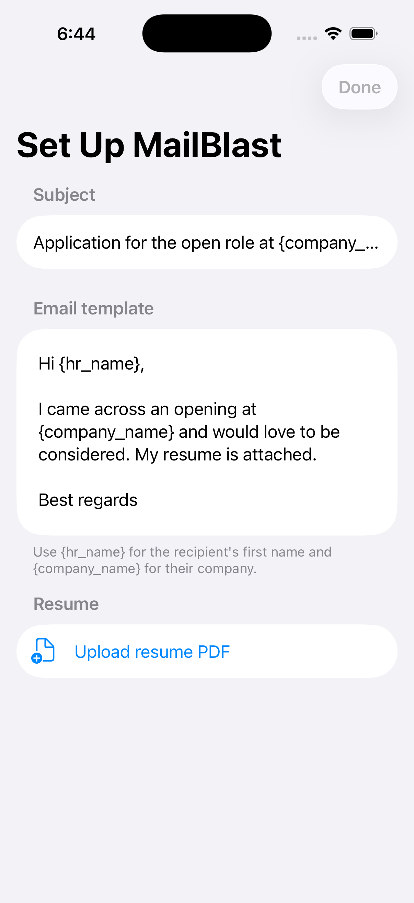
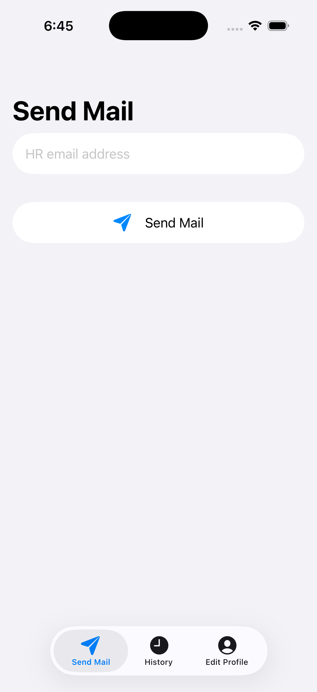
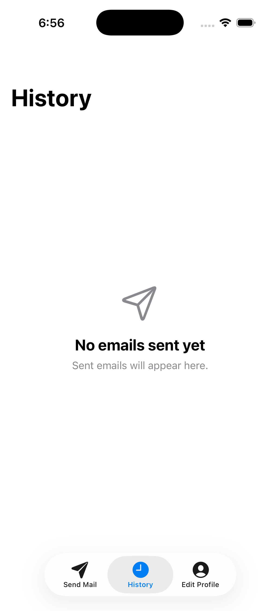
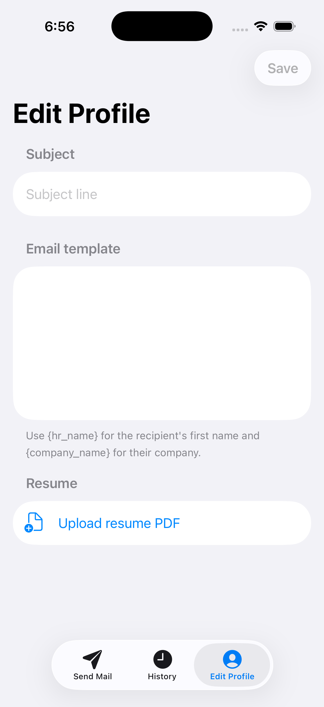

# MailBlast

A SwiftUI cold-email tool for iPhone. Save an email template, subject, and résumé once; then for any recipient, MailBlast extracts the HR name and company from the address, fills your template, and opens the iOS Mail composer with the résumé PDF already attached. Every send is logged to a local history.

> iOS 17+ · Swift 5 / SwiftUI · MVVM · SwiftData · no third-party dependencies

---

## Screenshots

| Onboarding | Send Mail |
|:---:|:---:|
|  |  |
| **History** | **Edit Profile** |
|  |  |

---

## Features

- **One-time onboarding** — set the email template (with `{hr_name}` / `{company_name}` placeholders), a subject line, and upload a résumé PDF.
- **Send Mail** — type a recipient, tap Send. MailBlast extracts the first name + company from the address, substitutes the placeholders, and opens `MFMailComposeViewController` pre-filled with subject, body, and the attached `resume.pdf`.
- **History** — every successful send is stored with SwiftData (recipient, extracted name, timestamp), newest first, swipe-to-delete.
- **Edit Profile** — update the template, subject, or re-upload the résumé at any time.
- **Deep link** — `emailblast://send?to=foo@acme.com` opens the app on the Send tab with the recipient pre-filled.
- **Share Extension** — capture an email address from any other app (Notes, LinkedIn, Safari…) via the share sheet.

---

## Project structure

```
MailBlast/
├── MailBlastApp.swift        App entry, SwiftData container, deep-link + clipboard routing
├── ContentView.swift         Onboarding gate + bottom tab bar
├── Onboarding/               First-run setup (template, subject, résumé)
├── SendMail/                 Recipient entry, placeholder substitution, mail composer
├── EditProfile/              Edit template / subject / résumé
├── History/                  SwiftData @Model + list view
├── Data/                     UserPreferencesStore, PDFStorageHelper, AppState (router)
├── Utilities/                MailComposerView, DocumentPickerView, EmailNameExtractor
└── Info.plist                Registers the emailblast:// URL scheme

ShareToMailBlast/             Share Extension target (capture email → clipboard hand-off)
```

### Architecture

- **MVVM** — `ObservableObject` view models with `@Published` state per feature.
- **Preferences** — template / subject / onboarding flag in `UserDefaults` (`@AppStorage` in views, `UserPreferencesStore` for non-view access).
- **Résumé** — copied into the app's Documents directory as `resume.pdf` on import; read back as `Data` for the mail attachment.
- **History** — SwiftData `@Model HistoryEntry`, queried with `@Query` (sorted by `sentAt` descending).
- **Routing** — `AppState` is the single channel for a pending recipient; both the URL scheme and the Share Extension feed into it.

### Placeholders

`{hr_name}` and `{company_name}` are substituted in both subject and body, matched case- and spacing-insensitively (`{hr_name}`, `{HR Name}`, `{hr name}` all work). Names are derived from the address: `john.doe@acme.com` → name **John**, company **Acme**.

---

## Build & run

Requires Xcode 16+ (developed on Xcode 26.5) and an iPhone on iOS 17+.

1. Open `MailBlast.xcodeproj`.
2. Select the **MailBlast** scheme and your device.
3. **Signing** — under each target's *Signing & Capabilities*, pick your Team (a free Personal Team works). Bundle IDs: `com.mailblast.app` and `com.mailblast.app.ShareToMailBlast`.
4. ⌘R.

> Mail sending requires a device with a Mail account configured. On the Simulator (or a device with no mail account) `MFMailComposeViewController.canSendMail()` is `false`, and the app shows an explanatory alert instead of the composer.

### Project format note

The project uses Xcode's file-system–synchronized groups, so files dropped into `MailBlast/` are picked up automatically. `MailBlast/Info.plist` is a *partial* plist (it only adds the `emailblast://` URL scheme) merged with the generated Info.plist, and is excluded from the synchronized group to avoid a duplicate-output build error.

---

## Deep linking & the Share Extension

**URL scheme** — `emailblast://send?to=<email>` is handled in `MailBlastApp` via `.onOpenURL`, routing to the Send tab with the recipient pre-filled. Test it by typing the URL into Safari.

**Share Extension** — select an email address (or a `mailto:` link) in any app → **Share → ShareToMailBlast**:

1. The extension extracts the email and copies it to the clipboard, showing an "Email Copied" confirmation.
2. Open MailBlast — on becoming active it detects the freshly-copied address (gated on `UIPasteboard.changeCount`, so no repeated paste banners) and pre-fills the Send tab.

> **Why the clipboard, not a direct launch?** On iOS, a Share Extension on a *free* Apple Developer account cannot launch its host app — `extensionContext.open` and the responder-chain `openURL:` trick are both blocked, and App Groups require a paid account. The clipboard hand-off is the reliable, entitlement-free path. With a paid account this could be upgraded to a silent App Group hand-off.

---

## Roadmap / ideas

- App Group hand-off (paid account) for a tap-free Share flow.
- "Filled from clipboard / share" banner on the Send screen.
- Multiple templates.
